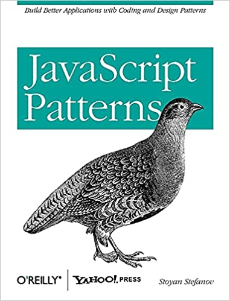
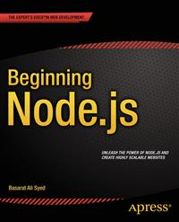

# JS-Learning-Archive
JS Learning Archive

# Books

# Course

Modern JavaScript from the beginning - all the way up to JS expert level! THE must-have JavaScript resource in 2021

[Udemy Link](https://www.udemy.com/course/javascript-the-complete-guide-2020-beginner-advanced/)

# Table of Contents

## ELEQUENT JAVASCRIPT
* [Source Code](https://github.com/ErdemOzgen/JS-Learning-Archive/tree/main/src/eloquentJavascript)
* Notes About Book
## JAVASCRIPT: THE GOOD PARTS
* Source Code
* Notes About Book
## JAVASCRIPT PATTERNS
* Source Code
* Notes About Book
## BEGINNING NODE.JS
* Source Code
* Notes About Book
## UDEMY COURSE
* [Source Code](https://github.com/ErdemOzgen/JS-Learning-Archive/blob/main/src/Udemy/)
* [Readme](https://github.com/ErdemOzgen/JS-Learning-Archive/blob/main/src/Udemy/Udemy.md)
* Notes About Course

# License
